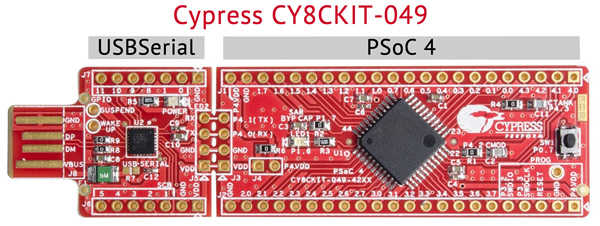
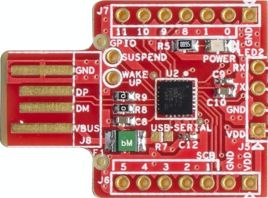

# Cyusbserial

[Cyusbserial](https://bitbucket.org/mcmayer/cyusbserial/src/master/) is is a [Haskell](https://www.haskell.org/) wrapper for the [Cypress](http://www.cypress.com) `cyusbserial` library for the USB bridging chips CY7C65211*, *CY7C65213* and *CY7C65215*. The main references are

- the home pages of the three chips [CY7C65211*](http://www.cypress.com/documentation/datasheets/cy7c65211-usb-serial-single-channel-uarti2cspi-bridge-capsense-and-bcd), [CY7C65213](http://www.cypress.com/documentation/datasheets/cy7c65213-usb-uart-lp-bridge-controller) and [CY7C65215](http://www.cypress.com/documentation/datasheets/cy7c65215-usb-serial-dual-channel-uarti2cspi-bridge-capsense-and-bcd),
- the [USB-Serial Software Development Kit](http://www.cypress.com/documentation/software-and-drivers/usb-serial-software-development-kit), and 

- the [USB-Serial Library API Guide](http://www.cypress.com/?docID=45725) Rev 1.0 (registration required)

Cypress has a cheap (4$) evaluation board [CY8CKIT-049](http://www.cypress.com/documentation/development-kitsboards/psoc-4-cy8ckit-049-4xxx-prototyping-kits) for one of their PSoC chips that also has a USB-serial converter with a CY7C65211 that can be broken off.



## The Haskell Wrapper

### Thin wrapper and 'safe' wrapper

`Cyusbserial` has a basic, *thin wrapper* that very closely mirrors the C API. It is located in `System.Cypress.USBSerial`. 

There is also a *'safe' wrapper* with proper error handling that also manages library initialization and orderly opening/closing of handles. It is located in `System.Cypress.USBSerial.Safe`.

### Usage

In most cases you'll want to use the safe wrapper,

```haskell
import System.Cypress.Safe.USBSerial
```

This is what is covered here.

#### Example

Let's go through a simple example:

1. Find a device,
2. open it, and then
3. extract library and firmware version and the firmware 'signature' 

(The signature is just a four letter string that is not explained anywhere and seems to have no particular use. Let's have it anyway.)

All functions in `System.Cypress.Safe.USBSerial` return the type

```haskell
Either ReturnStatus a
```

The (safe) USB functions have to be sequenced in the `USB` monad and executed with `runUSB`:

```haskell
runUSB :: USB a -> IO (Either ReturnStatus a)
```

so our new funcyion `getBasicInfos` begins with

```haskell
getBasicInfos :: IO (Either ReturnStatus (LibraryVersion, FirmwareVersion, Signature))
getBasicInfos = runUSB $ do
	...
```

First, you have to find the appropriate device in the device tree. The function `findDeviceWithVidPidTypeClass` lets you search the device tree for devices identified by

- vendor ID (`0x04b4`), 
- product ID (`0x0002`, i.e. CY7C65211 in UART mode), 
- device type (`DeviceType'MFG`), and 
- device class (`DeviceClass'Vendor`).

 `findDeviceWithVidPidTypeClass` returns either an error `ReturnStatus` or a non-empty list `[(DeviceID, InterfaceID)]`:

```haskell
devIfaceIds <- try $ findDeviceWithVidPidTypeClass 0x04b4 0x0002 DeviceType'MFG DeviceClass'Vendor
let (devID, ifaceID) = head devIfaceIds
```

`System.Cypress.Safe.USBSerial` uses the *Error Monad* (a.k.a. *Exception Monad*) from [Control.Monad.Except](https://hackage.haskell.org/package/mtl-2.2.2/docs/Control-Monad-Except.html#t:ExceptT).

The prepended `try` will extract the returned value or abort the whole `do` block with a `Left ReturnStatus`. Since `findDeviceWithVidPidTypeClass` will return ('throw') a `Left ReturnStatus` when nothing is found, or anything else goes wrong,  it is safe to use `head` on the returned list.

With `DeviceID` and `InterfaceID` obtained you can open the device

```haskell
withOpen devID ifaceID $ do
	...
```

`withOpen` has the signature

```haskell
withOpen :: DeviceID -> InterfaceID -> USBWithHandle a -> USB (Either ReturnStatus a) 
```

it works with the `USBWithHandle` monad - all functions that need a device handle act in this monad.

Now you can go ahead and extract all the required information:

```haskell
libVer <- try getLibraryVersion
fwVer <- try getFirmwareVersion
sig <- try getSignature
return (libVer, fwVer, sig)
```

One last thing to do is to fix the return type of `withOpen`. To avoid nested `Either`s you have to prepend a `try`. The final result is

```haskell
getBasicInfos :: IO (Either ReturnStatus (LibraryVersion, FirmwareVersion, Signature))
getBasicInfos = runUSB $ do
    devIfaceIds <- try $ findDeviceWithVidPidTypeClass 0x04b4 0x0002 DeviceType'MFG DeviceClass'Vendor
    let (devID, ifaceID) = head devIfaceIds	-- infos is guaranteed to be non-empty
    try $ withOpen devID ifaceID $ do
        libVer <- try getLibraryVersion
        fwVer <- try getFirmwareVersion
        sig <- try getSignature
        return (libVer, fwVer, sig)
```

### Device configuration

#### The safe way: Using the *Configuration Utility*

By default the CY7C6521x chips are configured as UART devices. If you want to use the SPI/I<sup>2</sup>C/SPI/JTAG/PHDC interfaces, or configure the GPIO pins, you have to reconfigure the chip. The safe way to do this is to use Cypress *Configuration Utility* (Windows only). It is part of the [USB-Serial SDK for Windows](http://www.cypress.com/documentation/software-and-drivers/usb-serial-software-development-kit).

#### Using `readConfigFlash` and `progConfigFlash`

The crude and unsafe way to do this (Linux and Mac) is to use the `readConfigFlash` and `progConfigFlash` functions in `System.Cypress.Safe.USBSerial.Extras`. These two functions are not part of the original API, instead they are reverse-engineered. These functions are **absolutely not guaranteed to work**, in particular if Cypress does any firmware updates. Be careful with these two functions, you may well brick your chip.

The recommended (i.e. *only*) way to use  `readConfigFlash` and `progConfigFlash` is to configure the chip on Windows with the Configuration Utility, then export the config flash content with `readConfigFlash`, and then program the config flash contents again with `progConfigFlash` whenever necessary. This seems to work. But again: Be careful, or you will brick your chip.

## About Cypress' USB Bridging Chips

Cypress has three USB bridging chips: *CY7C65211*, *CY7C65213* and *CY7C65215*. 

The main features are:

- **USB 2.0**-certified, Full-Speed (12 Mbps)
  - Support for communication driver class (CDC), personal health care device class (PHDC), and vendor-specific drivers
  - Battery charger detection (BCD)
- Configurable **UART interface**(s)
  - Data rates up to 3 Mbps
- **GPIO** pins (CY'11: 10x, CY'13: 8x, CY'15: 17x)
- Operating voltage: 1.71 to 5.5 V

The *CY7C65211* and *CY7C65215* also have

- Configurable **SPI interface**
  - Data rate up to 3 MHz for SPI master and 1 MHz for SPI slave
  - Data width: 4 bits to 16 bits
  - Support of Motorola, TI, and National SPI modes
- Configurable **I<sup>2</sup>C interface**
  - Master/slave up to 400 kHz
  - Support of multi-master I<sup>2</sup>C
- JTAG interface: JTAG master for code flashing at 400 kHz

| Device                                                       | Datasheet                                                | Price/$ @1000 | Remarks                                                      |
| ------------------------------------------------------------ | -------------------------------------------------------- | ------------- | ------------------------------------------------------------ |
| [*CY7C65211*](http://www.cypress.com/documentation/datasheets/cy7c65211-usb-serial-single-channel-uarti2cspi-bridge-capsense-and-bcd) | [datasheet](http://www.cypress.com/file/139886/download) | 1.60-1.70     | Single SCB; Cheap breakout board available as part of [CY8CKIT-049](http://www.cypress.com/documentation/development-kitsboards/psoc-4-cy8ckit-049-4xxx-prototyping-kits) |
| [*CY7C65213*](http://www.cypress.com/documentation/datasheets/cy7c65213-usb-uart-lp-bridge-controller) | [datasheet](http://www.cypress.com/file/139881/download) | 1.50-1.60     | One SCB, only UART capable                                   |
| [*CY7C65215*](http://www.cypress.com/documentation/datasheets/cy7c65215-usb-serial-dual-channel-uarti2cspi-bridge-capsense-and-bcd) | [datasheet](http://www.cypress.com/file/129956/download) | 1.70-1.80     | Two SCBs, more GPIOs                                         |

SCB=**S**erial **C**ommunication **B**lock

#### CY7C65211

| Mode                    | Protocol    | PID    |
| ----------------------- | ----------- | ------ |
| UART                    | CDC         | 0x0002 |
| UART/SPI/I<sup>2</sup>C | Vendor/PHDC | 0x0004 |

#### CY7C65213

| Mode | Protocol    | PID    |
| ---- | ----------- | ------ |
| UART | CDC         | 0x0003 |
| UART | Vendor/PHDC | 0x0006 |

#### CY7C65215

| Mode SCB0               | Protocol SCB0 | Mode SCB1                    | Protocol SCB1 | PID    |
| ----------------------- | ------------- | ---------------------------- | ------------- | ------ |
| UART                    | CDC           | UART                         | CDC           | 0x0005 |
| UART                    | CDC           | UART/SPI/I<sup>2</sup>C/JTAG | Vendor/PHDC   | 0x0007 |
| UART/SPI/I<sup>2</sup>C | Vendor/PHDC   | UART                         | CDC           | 0x0009 |
| UART/SPI/I2C            | Vendor/PHDC   | I2C/JTAG/I2C/JTAG            | Vendor/PHDC   | 0x000A |

## Eval Kits

### CY8CKIT-049 protoyping kit

The CY8CKIT-049 is of interest here because it has a USB-setial module with a CY7C65211 that can be broken off. For more information see [docs/CY8CKIT-049-42xx.md](docs/CY8CKIT-049-42xx.md).



### CYUSBS234 USB-Serial (Single Channel) Development Kit

The [CYUSBS234](http://www.cypress.com/documentation/development-kitsboards/cyusbs234-usb-serial-single-channel-development-kit) is an inexpensive (25$) dev kit with which all features of the CY7C65211 chip can be explored.

### Breakout Board by David Freitag

There is also a nice little breakout board PCB by [David Freitag](https://github.com/dvdfreitag) on [github](https://github.com/dvdfreitag/CY7C65211-Breakout).

## `cyusbserial` Internals

See  [Internals.md](docs/Internals.md).

## Licensing

Cypress' licensing information is messy. The exact terms had to be clarified in questions posted on the [Cypress developer community forum](https://community.cypress.com). In a nutshell:

- On Linux and Mac the libraries in the SDK of CyUSBserial are opensource and licensed under the LGPL 2.1 (see [here](https://community.cypress.com/message/153411#153411)). LGPL 2.1 is basically inherited from the `libusb` license terms.
- On Windows the libraries are covered under Cypress' own license agreement that seems to be a LGPL variant, effectively. See [here](https://community.cypress.com/message/169733#169733), in particular §1.3 of the attached `license.txt`.

To keep it simple this `cyusbserial` library carries the LGPL-2.1 license itself.