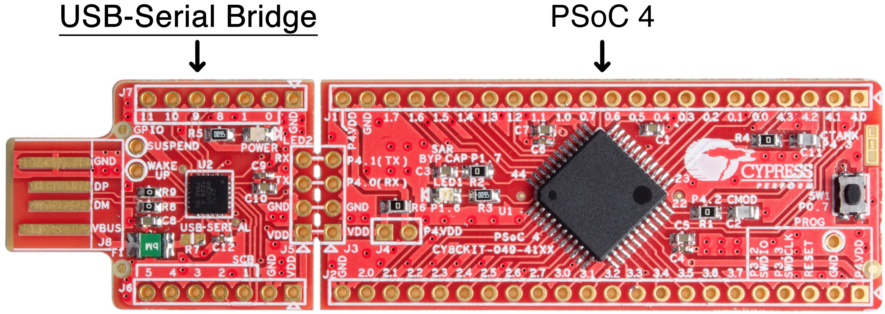
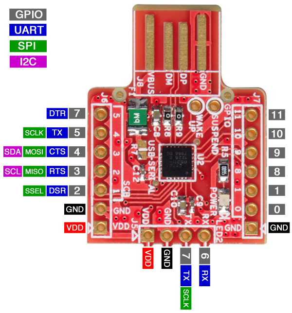
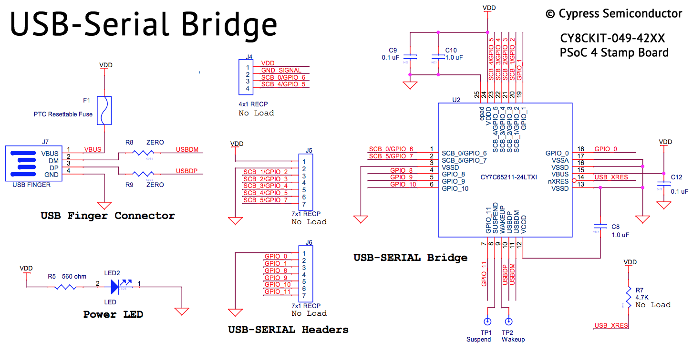

# CY8CKIT-049-42xx

## Pinout

| J4 pin | CY7C65211 Pin |     0      |     1      |     2      |     3      |     4     |     5      |     6     |
| :----: | ------------- | :--------: | :--------: | :--------: | :--------: | :-------: | :--------: | :-------: |
|        |               | 6-pin UART | 4-pin UART | 2-pin UART | SPI Master | SPI Slave | I2C Master | I2C Slave |
|   1    | VDD           |            |            |            |            |           |            |           |
|   2    | GND           |            |            |            |            |           |            |           |
|   3    | SCB_0         |     RX     |     RX     |     RX     |   GPIO_6   |  GPIO_6   |   GPIO_6   |  GPIO_6   |
|   4    | SCB_4         |     TX     |     TX     |     TX     |    SCLK    |   SCLK    |   GPIO_5   |  GPIO_5   |

| J5 pin | CY7C65211 Pin |     0      |     1      |     2      |     3      |     4     |     5      |     6     |
| :----: | ------------- | :--------: | :--------: | :--------: | :--------: | :-------: | :--------: | :-------: |
|        |               | 6-pin UART | 4-pin UART | 2-pin UART | SPI Master | SPI Slave | I2C Master | I2C Slave |
|   1    | VDD           |            |            |            |            |           |            |           |
|   2    | GND           |            |            |            |            |           |            |           |
|   3    | SCB_1         |    DSR#    |   GPIO_2   |   GPIO_2   |    SSEL    |   SSEL    |   GPIO_2   |  GPIO_2   |
|   4    | SCB_2         |    RTS#    |    RTS#    |   GPIO_3   |    MISO    |   MISO    |    SCL     |    SCL    |
|   5    | SCB_3         |    CTS#    |    CTS#    |   GPIO_4   |    MOSI    |   MOSI    |    SDA     |    SDA    |
|   6    | SCB_4         |     TX     |     TX     |     TX     |    SCLK    |   SCLK    |   GPIO_5   |  GPIO_5   |
|   7    | SCB_5         |    DTR#    |   GPIO_7   |   GPIO_7   |   GPIO_7   |  GPIO_7   |   GPIO_7   |  GPIO_7   |

| J7 pin | CY7C65211 Pin |          |
| :----: | ------------- | -------- |
|   1    | GND           |          |
|   2    | GPIO_0        | TXLED#   |
|   3    | GPIO_1        | RXLED#   |
|   4    | GPIO_8        | TRISTATE |
|   5    | GPIO_9        | TRISTATE |
|   6    | GPIO_10       | TRISTATE |
|   7    | GPIO_11       | TRISTATE |

## Schematic

